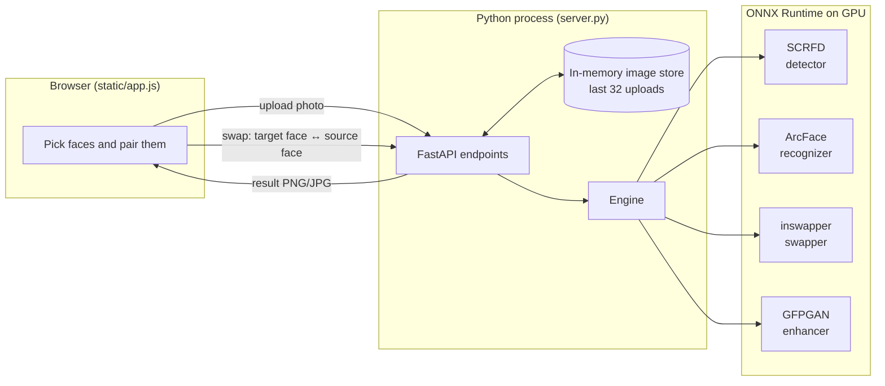

# How faceswap works

This document explains what happens between uploading a photo and downloading the swapped result. It covers each model, the image maths, the server, the browser UI and the offline guard. For install and usage, see [README.md](README.md).

## The big picture

The app is a small Python web server that serves a single-page UI to your browser. The browser only handles clicks and display. All image work happens in the Python process, which runs four neural networks through ONNX Runtime on your GPU.



A swap needs two kinds of information about a face:

- **Where it is and how it's posed.** The detector gives a box plus 5 landmarks: both eyes, the nose tip and both mouth corners. These are used for the face in the photo being changed.
- **Who it is.** The recognizer turns a face into a 512-number "identity" vector. It is used for the replacement face.

The swapper takes the target face's pixels plus the source identity vector and redraws the face as that person, keeping the target's pose, expression and lighting. The result is then blended back into the original photo.

## Walkthrough of one swap

### 1. Upload and detection (`POST /api/images`)

`server.py` reads the file with OpenCV (`cv2.imdecode`), which applies EXIF rotation so phone photos come out upright. It then calls `Engine.detect`.

**SCRFD detector** (`detect.py`, model `det_10g.onnx`):

1. **Letterbox.** The image is scaled to fit a square canvas (640×640 by default) without distortion, and the leftover area is padded black at the bottom and right. With **find small faces** on, the canvas grows to match the photo (up to 1920 px), so distant faces cover more pixels and get detected. This is slower.
2. **Normalise.** Pixels are converted BGR→RGB and mapped to roughly −1…1 using `(pixel − 127.5) / 128`.
3. **Run the network.** SCRFD predicts on three grids, with strides 8, 16 and 32 pixels, for small, medium and large faces. Each grid cell has 2 anchors. For every anchor the network outputs:
   - a face score,
   - 4 distances from the anchor centre to the box edges (left, top, right, bottom),
   - 5 landmark offsets from the anchor centre.
4. **Decode.** Anchors scoring at least 0.5 are kept. Distances and offsets are multiplied by the stride and added to the anchor centre, giving boxes and landmarks in canvas pixels. Dividing by the letterbox scale maps them back to the original photo.
5. **Non-maximum suppression.** Several neighbouring anchors usually fire for the same face. Boxes that overlap a higher-scoring box by more than 40% IoU are dropped.
6. **Sort left to right** by box centre, so face #1 is the leftmost face in the picture.

The server stores the decoded image and its faces in an in-memory LRU cache (`ImageStore`, 32 entries) under a random id. It returns the id, each face's box, score and a small JPEG thumbnail. The browser displays the image by fetching `/api/images/{id}/preview`, which is re-encoded from the same decoded pixels, so the boxes line up exactly.

### 2. Pairing faces (browser only)

`static/app.js` keeps all of this state in the browser; the server only sees the final list of pairs.

- `target`: the photo being changed and its faces
- `sources`: any number of replacement photos
- `selectedTarget`: the face currently selected on the left
- `pairs`: a map from target face number to *(source photo id, source face number)*

Clicking a target face selects it. Clicking a source face pairs it with the selected target face. If you click a source face first, it waits (`pendingSource`) until you pick a target face. A photo with only one face is selected or paired automatically. Nothing is computed while you click; the models run only when you press **Swap**.

### 3. The swap request (`POST /api/swap`)

The request body lists the pairs:

```json
{
  "target_id": "…",
  "swaps": [{ "target_face": 0, "source_id": "…", "source_face": 3 }],
  "enhance": true,
  "enhance_blend": 0.8,
  "format": "png"
}
```

The server checks every face index and rejects a target face that is assigned twice. It then calls `Engine.swap`, which handles each pair in turn:

#### 3a. Identity of the source face — ArcFace (`recognize.py`, `w600k_r50.onnx`)

1. **Align.** ArcFace was trained on faces cropped so the eyes, nose and mouth sit at fixed positions in a 112×112 image. `align.umeyama` computes the best **similarity transform** (rotation + uniform scale + translation, no stretching) that moves the detected 5 landmarks onto those template positions. It is a least-squares fit using an SVD, the same maths as scikit-image's `SimilarityTransform`. `cv2.warpAffine` then cuts out the aligned 112×112 face.
2. **Embed.** The crop is normalised to −1…1 and fed to the network, which outputs a 512-dimensional vector. The vector is divided by its length (L2-normalised). Two photos of the same person give vectors with a dot product (cosine similarity) near 1; different people are near 0.
3. The vector is cached on the `Face` object, so reusing a source face costs nothing.

#### 3b. Redrawing the target face — inswapper (`swap.py`, `inswapper_128.onnx`)

1. **Align the target face** the same way, but to a 128×128 crop. The template is the 112 template shifted 8 px right, which is what the model expects. The alignment matrix `M` is kept for later.
2. **Project the identity.** The swapper doesn't take the ArcFace vector directly. It expects it multiplied by a 512×512 matrix called `emap`, which is stored as the last weight inside the ONNX file. `swap._load_emap` reads it with the `onnx` package once and caches it as `inswapper_128.emap.npy`. The projected vector is re-normalised.
3. **Run the network** with two inputs: the target crop (RGB, 0…1) and the projected identity. The output is a 128×128 face with the source's identity and the target's pose, expression and lighting.

#### 3c. Blending back into the photo (`align.paste_back`)

1. **Build a soft mask** in crop space (`align.box_mask`): a square of 1s with a zero border, blurred with a Gaussian so the edge fades out. The top border is larger (1/8 of the crop) because the top of the crop is forehead and hairline. Keeping it out stops the source's hair colour from bleeding onto the target's forehead.
2. **Invert `M`** to get the transform from crop space back to photo space.
3. **Work only on the face region.** The four crop corners are mapped into the photo to find a bounding box. Only that region is warped and blended, so a swap on a 24-megapixel photo is as fast as on a small one.
4. **Alpha-blend:** `result = mask × swapped + (1 − mask) × original`.

#### 3d. Optional sharpening — GFPGAN (`enhance.py`, `gfpgan_1.4.onnx`)

inswapper works at 128 px, so a face that is 400 px wide in the photo looks soft once it is scaled back up. With **enhance face** on, after each swap:

1. The swapped face is aligned to the FFHQ template at 512×512. This is the layout GFPGAN was trained on, and it covers more of the head than the ArcFace crop.
2. GFPGAN restores detail such as skin texture, eyes and teeth, working in −1…1 RGB.
3. The result is blended back with a wide feathered mask multiplied by the **strength** slider (default 80%). Lower values keep more of the original swap, which can look more natural.

Pairs run one after another on the same working image. Each uses landmarks detected on the original upload, so later swaps aren't affected by earlier ones.

### 4. The result

The finished image is encoded as PNG (lossless) or JPEG (quality 95) and sent straight back. It is never written to disk. The browser shows it from a `blob:` URL:

- **Hold to compare** temporarily swaps the displayed image for the original preview.
- **Download** saves the blob.
- **Use as new photo** uploads the result again as a fresh target, so you can keep swapping.

## GPU selection (`runtime.py`)

ONNX Runtime runs a model on an *execution provider*. With `--provider auto` the app picks the first one available, in this order:

1. `CUDAExecutionProvider` (NVIDIA, from the `cuda` / `cuda13` extras)
2. `DmlExecutionProvider` (DirectML: any DirectX 12 GPU on Windows, from the `directml` extra)
3. `CoreMLExecutionProvider` (Apple)
4. `CPUExecutionProvider`

Two details matter:

- **CUDA libraries.** For CUDA it first calls `onnxruntime.preload_dlls()`, which loads CUDA and cuDNN from the `nvidia-*` pip packages. That's why no CUDA toolkit install is needed.
- **Detector speed.** cuDNN is told to use its default convolution algorithm (`cudnn_conv_algo_search = DEFAULT`) rather than benchmarking every option. The detector's input size changes with **find small faces**, and exhaustive benchmarking would repeat for each new size.

Every session also lists CPU as a fallback. The header badge shows the provider that actually loaded (`session.get_providers()[0]`), not just the one requested. Model calls go through a single lock, so parallel requests queue instead of competing for GPU memory.

## The offline guard (`offline.py`)

When the server starts (unless you pass `--allow-network`), `enforce_offline()` replaces a few functions in Python's `socket` module for the whole process:

| Patched function | What it now does |
| --- | --- |
| `socket.getaddrinfo` | Refuses to resolve any name except `localhost` and literal loopback addresses. No DNS lookups can leave the machine. |
| `socket.connect`, `connect_ex`, `sendto` | Refuses every IPv4/IPv6 destination except loopback ports **this process is itself listening on**. |
| `socket.listen` | Records the port of each listening socket so the rule above can allow it. |

It also deletes `HTTP_PROXY`, `HTTPS_PROXY` and similar environment variables.

The "own ports only" rule matters. Allowing all of `127.0.0.1` would let a library send traffic through a local proxy or VPN client, which forwards it to the internet. That leak happened in testing before this rule was added. Own ports still have to be allowed, because asyncio on Windows builds its internal wake-up pipe by connecting to a loopback socket it just opened.

The rest of the airgap story:

- The server binds to `127.0.0.1`, so other machines can't reach it.
- The UI loads nothing from outside the local server: no CDN scripts or web fonts.
- Uploads live only in memory.
- Models come from a separate command, `python -m faceswap.download`, which never runs as part of the app. It checks each file's SHA-256 against pinned values in `models.py`, and it can try a second mirror if the first one fails or serves a different file.

This guard only covers Python code in this process; it can't stop other programs. For a hard guarantee, also firewall the Python executable or disconnect the PC.

## File map

| File | Role |
| --- | --- |
| `faceswap/__main__.py` | CLI entry point: parses flags, turns on the offline guard, loads models, starts uvicorn, opens the browser |
| `faceswap/server.py` | FastAPI app: upload/detect, preview, swap endpoints, image store, input validation |
| `faceswap/engine.py` | Loads the four models once; `detect`, `embedding`, `swap` |
| `faceswap/detect.py` | SCRFD: letterbox, anchor decoding, NMS, `Face` dataclass |
| `faceswap/recognize.py` | ArcFace embedding |
| `faceswap/swap.py` | inswapper: `emap` projection, inference, mask |
| `faceswap/enhance.py` | GFPGAN restoration |
| `faceswap/align.py` | Umeyama similarity fit, ArcFace/FFHQ templates, warp, soft masks, region-limited paste-back |
| `faceswap/runtime.py` | Execution-provider selection and ONNX session creation |
| `faceswap/offline.py` | Network kill switch |
| `faceswap/models.py` | Model manifest: filenames, download URLs, SHA-256 checksums |
| `faceswap/download.py` | Downloads and verifies models (run separately, online) |
| `faceswap/static/` | UI: `index.html`, `app.css`, `app.js` (no framework, no external assets) |
| `tests/test_align.py` | Unit tests: alignment maths, paste-back, offline guard |
| `tests/test_pipeline.py` | End-to-end tests with real models (set `FACESWAP_TEST_IMAGE`) |

## Things you can tune

| Setting | Where | Effect |
| --- | --- | --- |
| Detection threshold `0.5` | `Detector.detect(threshold=…)` | Lower finds more faces but also more false positives. |
| NMS threshold `0.4` | `Detector.detect(nms_thresh=…)` | Higher keeps more overlapping boxes, e.g. for faces close together in a crowd. |
| Thorough detection size | `Engine.detect` | Maximum canvas size for **find small faces** (1920). |
| Swap mask border and blur | `Swapper.__init__` → `box_mask(...)` | Bigger border keeps more of the original face edge. More blur gives a softer seam. |
| Enhancer mask | `Enhancer.__init__` | Same idea for the GFPGAN blend. |
| Image cache size | `ImageStore(capacity=32)` | How many uploads stay available before the oldest is dropped. |
| Upload limits | `MAX_UPLOAD_BYTES`, `MAX_PIXELS` in `server.py` | 64 MB per file, 60 megapixels. |

## Known limitations

- **Resolution.** inswapper is a 128 px model. Enhancement helps, but very large faces never get fully sharp detail.
- **Profile views and occlusion.** Side profiles, hands in front of faces and heavy sunglasses hurt both detection and swap quality. The mask is a feathered square, not a face segmentation, so an object in front of the face gets painted over.
- **Hair and face shape.** Only the inner face changes. The target's hair, head shape and ears stay, so very different hairlines or face shapes can look off.
- **Skin tone and lighting.** These come from the target photo. Replacement photos with extreme lighting can carry a colour cast.
